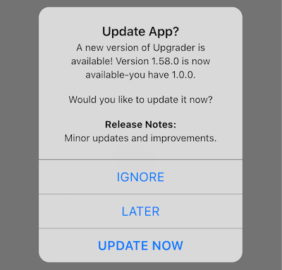
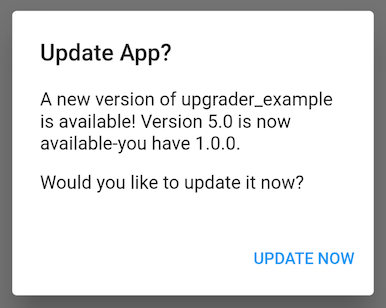

# Upgrader

[](https://app.travis-ci.com/github/larryaasen/upgrader)
[](https://app.codecov.io/gh/larryaasen/upgrader)
[](https://pub.dartlang.org/packages/upgrader)
[](https://github.com/larryaasen/upgrader/stargazers)
<a href="https://www.buymeacoffee.com/larryaasen">
  
</a>
[](https://twitter.com/upgraderpackage)

A Flutter package for prompting users to upgrade when there is a newer version of the app in the store.

## Overview 

When a newer app version is available in the app store, a simple alert prompt or card is
displayed.

With today's modern app stores, there is little need to persuade users to upgrade
their apps because most are already using the auto upgrade feature. However, there may be times when
an app needs to be updated more quickly than usual, and nagging a user to upgrade will entice
the upgrade sooner. Also, with Flutter supporting more than just Android and iOS platforms, it
will become more likely that users on other app stores need to be nagged about upgrading.

### Platform Support

| Platform | Automatically Supported? | Appcast Supported? |
| --- | --- | --- |
| ANDROID | &#9989; Yes | &#9989; Yes |
| IOS | &#9989; Yes | &#9989; Yes |
| LINUX | &#10060; No | &#9989; Yes |
| MACOS | &#10060; No | &#9989; Yes |
| WEB | &#10060; No | &#9989; Yes |
| WINDOWS | &#10060; No | &#9989; Yes |

## Widgets
The widgets come in two flavors: alert or card. The [UpgradeAlert](#alert-example) widget is used to display the
popup alert prompt, and the [UpgradeCard](#card-example) widget is used to display the inline material design card.

There are three buttons displayed to the user: IGNORE, LATER, and UPDATE NOW.

Tapping IGNORE prevents the alert from being displayed again for that version.

Tapping the LATER button just closes the alert allowing the alert to be displayed sometime in the future.

Tapping the UPDATE NOW button takes the user to the App Store (iOS) or Google Play Store (Android) where the user is expected to initiate the update process.

## Alert Example

Just wrap your home widget in the `UpgradeAlert` widget, and it will handle the rest.
```dart
class MyApp extends StatelessWidget {
  const MyApp({Key key}) : super(key: key);

  @override
  Widget build(BuildContext context) {
    return MaterialApp(
      title: 'Upgrader Example',
      home: UpgradeAlert(
          child: Scaffold(
        appBar: AppBar(title: Text('Upgrader Example')),
        body: Center(child: Text('Checking...')),
      )),
    );
  }
}
```

## Screenshot of alert


## Cupertino alert example

You can also display a Cupertino style dialog by using the `dialogStyle` parameter.
```dart
  body: UpgradeAlert(
    dialogStyle: UpgradeDialogStyle.cupertino,
    child: Center(child: Text('Checking...')),
  )
```

## Screenshot of Cupertino alert



## Card Example

Just return an `UpgradeCard` widget in your build method and a material design card will be displayed
when an update is detected. The widget will have width and height of 0.0 when no update is detected.
```dart
return Container(
        margin: EdgeInsets.fromLTRB(12.0, 0.0, 12.0, 0.0),
        child: UpgradeCard());
```

## Screenshot of card


## Localization
The text displayed in the `upgrader` package is localized in [many languages](#language-localization), and supports customization.

## Release Notes
The release notes are displayed by default when a new version is available. On Android
the release notes are taken from the the WHAT'S NEW section on Google Play when
available, otherwise the main app description is used.
On iOS the release notes are taken from the App Store What's New section.
For [appcast](#appcast)), the release notes are taken from the description field.

## Customization

The alert can be customized by changing the `DialogTheme` on the `MaterialApp`, or by overriding methods in the `UpgradeAlert` class. See these examples for more details:
- [example/lib/main-alert-theme.dart](example/lib/main-alert-theme.dart)
- [example/lib/main-custom-alert.dart](example/lib/main-custom-alert.dart)

The card can be customized by changing the `CardTheme` on the `MaterialApp`, or by overriding methods in the `UpgradeCard` class. See these examples for more details:
- [example/lib/main-card-theme.dart](example/lib/main-card-theme.dart)
- [example/lib/main-custom-card.dart](example/lib/main-custom-card.dart)

Here are the custom parameters for `UpgradeAlert`:

* canDismissDialog: can alert dialog be dismissed on tap outside of the alert dialog, which defaults to ```false``` (not used by UpgradeCard)
* cupertinoButtonTextStyle: the text style for the cupertino dialog buttons, which defaults to ```null```
* dialogStyle: the upgrade dialog style, either ```material``` or ```cupertino```, defaults to ```material```, used only by UpgradeAlert, works on Android and iOS.
* onIgnore: called when the ignore button is tapped, defaults to ```null```
* onLater: called when the later button is tapped, defaults to ```null```
* onUpdate: called when the update button is tapped, defaults to ```null```
* shouldPopScope: called when the back button is tapped, defaults to ```null```
* showIgnore: hide or show Ignore button, which defaults to ```true```
* showLater: hide or show Later button, which defaults to ```true```
* showReleaseNotes: hide or show release notes, which defaults to ```true```

Here are the custom parameters for `UpgradeCard`:

* margin: The empty space that surrounds the card, defaults to ```null```
* maxLines: An optional maximum number of lines for the text to span, wrapping if necessary, defaults to ```null```
* onIgnore: called when the ignore button is tapped, defaults to ```null```
* onLater: called when the later button is tapped, defaults to ```null```
* onUpdate: called when the update button is tapped, defaults to ```null```
* overflow: How visual overflow should be handled, defaults to ```null```
* showIgnore: hide or show Ignore button, which defaults to ```true```
* showLater: hide or show Later button, which defaults to ```true```
* showReleaseNotes: hide or show release notes, which defaults to ```true```

The `Upgrader` class can be customized by setting parameters in the constructor, and passing it

* appcast: Provide an Appcast that can be replaced for mock testing, defaults to ```null```
* appcastConfig: the appcast configuration, defaults to ```null```
* client: an HTTP Client that can be replaced for mock testing, defaults to ```null```
* countryCode: the country code that will override the system locale, which defaults to ```null```
* languageCode: the language code that will override the system locale, which defaults to ```null```
* debugDisplayAlways: always force the upgrade to be available, defaults to ```false```
* debugDisplayOnce: display the upgrade at least once, defaults to ```false```
* debugLogging: display logging statements, which defaults to ```false```
* durationUntilAlertAgain: duration until alerting user again, which defaults to ```3 days```
* messages: optional localized messages used for display in `upgrader`
* minAppVersion: the minimum app version supported by this app. Earlier versions of this app will be forced to update to the current version. It should be a valid version string like this: ```2.0.13```. Defaults to ```null```.
* upgraderOS: Provides information on which OS this code is running on, defaults to ```null```
* willDisplayUpgrade: called when ```upgrader``` determines that an upgrade may
or may not be displayed, defaults to ```null```

## Minimum App Version
The `upgrader` package can enforce a minimum app version simply by adding a
version number to the description field in the app stores.

For the Android Play Store, use this format:
```
[Minimum supported app version: 1.2.3]
```

For the iOS App Store, use this format:
```
[:mav: 1.2.3]
```

Using that text says that the minimum app version is 1.2.3 and that earlier
versions of this app will be forced to update to the current version. The Ignore
and Later buttons will automatically be hidden.




After the app containing this text has been submitted for review, approved, and
released on the app store, the version number will be visible to the `upgrader`
package. When the minimum app version is updated in the future, all previously
installed apps with this package will recognize and honor that value.

This overrides any value supplied in the `minAppVersion` parameter.

### Android
Add this text to the bottom of the full description field in the Google Play
Console under the main store listing.

### iOS
Add this text to the bottom of the description field in App Store Connect in the
description field.

## Go Router

When using GoRouter (package go_router) with upgrader, you may need to provide
a navigatorKey to the ```UpgradeAlert``` widget so that the correct route 
context is used. Below is part of the code you will need for this. Also,
checkout the [example/lib/main-gorouter.dart](example/lib/main-gorouter.dart) example for a more complete example.

```
  @override
  Widget build(BuildContext context) {
    return MaterialApp.router(
      title: 'Upgrader GoRouter Example',
      routerConfig: routerConfig,
      builder: (context, child) {
        return UpgradeAlert(
          navigatorKey: routerConfig.routerDelegate.navigatorKey,
          child: child ?? Text('child'),
        );
      },
    );
  }
```

## Android Back Button

When using the ```UpgradeAlert``` widget, the Android back button will not
dismiss the alert dialog by default. To allow the back button to dismiss the
dialog, use ```shouldPopScope``` and return true like this:
```
UpgradeAlert(shouldPopScope: () => true);
```

## Country Code

On iOS, when your app is _not_ in the `US` App Store, which is the default, you must use
the `countryCode` parameter mentioned above. The `upgrader` package does not know
which country app store to use because it is not provided by iOS. It assumes
the app is in the `US` App Store.

On Android, the `upgrader` package uses the system locale to determine the country code.

## Android Language Code

Android description and release notes language default to `en`.

## Limitations
These widgets work on both Android and iOS. When running on Android the Google
Play Store will provide the latest app version.
 When running on iOS the App Store will provide the
latest app version. In all cases, the widget will display the prompt at the
appropriate times.

On Android, the version number is often not available from the Google Play
Store, such as with the
[Google Maps](https://play.google.com/store/apps/details?id=com.google.android.apps.maps)
app. In this case, the version is listed as `Varies with device`. That is not a
valid version for `upgrader` and cannot be used. The `upgrader` widget will not be
displayed in this case.

There is an [appcast](#appcast) that can be used to remotely configure the
latest app version. See [appcast](#appcast) below for more details.

## Appcast

The class [Appcast](lib/src/appcast.dart), in this Flutter package, is used by the `upgrader` widgets
to download app details from an appcast,
based on the [Sparkle](https://sparkle-project.org/) framework by Andy Matuschak.
You can read the Sparkle documentation here:
https://sparkle-project.org/documentation/publishing/.

An appcast is an RSS feed with one channel that has a collection of items that each describe
one app version. The appcast will describe each app version and will provide the latest app
version to `upgrader` that indicates when an upgrade should be recommended.

The appcast must be hosted on a server that can be reached by everyone from the app. The appcast
XML file can be autogenerated during the release process, or just manually updated after a release
is available on the app store.

The Appcast class can be used stand alone or as part of `upgrader`.

### Appcast Example
This is an Appcast example for Android.
```dart
static const appcastURL =
    'https://raw.githubusercontent.com/larryaasen/upgrader/master/test/testappcast.xml';
final upgrader = Upgrader(
    appcastConfig:
        AppcastConfiguration(url: appcastURL, supportedOS: ['android']));

@override
Widget build(BuildContext context) {
  return MaterialApp(
    title: 'Upgrader Example',
    home: Scaffold(
        appBar: AppBar(title: Text('Upgrader Appcast Example')),
        body: UpgradeAlert(
          upgrader: upgrader,
          child: Center(child: Text('Checking...')),
        )),
  );
}
```

### Appcast Sample File
```xml
<?xml version="1.0" encoding="utf-8"?>
<rss version="2.0" xmlns:sparkle="http://www.andymatuschak.org/xml-namespaces/sparkle">
    <channel>
        <title>Debt Now App - Appcast</title>
        <item>
            <title>Version 1.15.0</title>
            <description>Minor updates and improvements.</description>
            <pubDate>Sun, 30 Dec 2018 12:00:00 +0000</pubDate>
            <enclosure url="https://play.google.com/store/apps/details?id=com.moonwink.treasury" sparkle:version="1.15.0" sparkle:os="android" />
        </item>
    </channel>
</rss>
```

### Appcast Class
```dart
final appcast = Appcast();
final items = await appcast.parseAppcastItemsFromUri('https://raw.githubusercontent.com/larryaasen/upgrader/master/test/testappcast.xml');
final bestItem = appcast.bestItem();
```

## Customizing the strings

The strings displayed in `upgrader` can be customzied by extending the `UpgraderMessages` class
to provide custom values.

As an example, to replace the Ignore button with a custom value, first create a new
class that extends UpgraderMessages, and override the buttonTitleIgnore function. Next,
when calling UpgradeAlert (or UpgradeCard), add the parameter messages with an instance
of your extended class. Here is an example:

```dart
class MyUpgraderMessages extends UpgraderMessages {
  @override
  String get buttonTitleIgnore => 'My Ignore';
}

UpgradeAlert(Upgrader(messages: MyUpgraderMessages()));
```

## Language localization

The strings displayed in `upgrader` are already localized in 34 languages. New languages will be
supported in the future with minor updates. It also supports right to left languages.

Languages supported:
* English ('en')
* Arabic ('ar')
* Bengali ('bn')
* Chinese ('zh')
* Danish ('da')
* Dutch ('nl')
* Filipino ('fil')
* French ('fr')
* German ('de')
* Greek ('el')
* Haitian Creole ('ht')
* Hebrew ('he')
* Hindi ('hi')
* Hungarian ('hu')
* Indonesian ('id')
* Italian ('it')
* Japanese ('ja')
* Kazakh ('kk')
* Khmer ('km')
* Korean ('ko')
* Lithuanian ('lt')
* Mongolian ('mn')
* Norwegian ('nb')
* Persian ('fa')
* Polish ('pl')
* Portuguese ('pt')
* Russian ('ru')
* Spanish ('es')
* Swedish ('sv')
* Tamil ('ta')
* Telugu ('te')
* Turkish ('tr')
* Ukrainian ('uk')
* Vietnamese ('vi')

The `upgrader` package can be supplied with additional languages in your code by extending the `UpgraderMessages` class
to provide custom values.

As an example, to add the Spanish (es) language (which is already provided), first create a new
class that extends UpgraderMessages, and override the message function. Next, add a string for
each of the messages. Finally, when calling UpgradeAlert (or UpgradeCard), add the parameter messages with an instance
of your extended class. Here is an example:

```dart
class MySpanishMessages extends UpgraderMessages {
  /// Override the message function to provide custom language localization.
  @override
  String message(UpgraderMessage messageKey) {
    if (languageCode == 'es') {
      switch (messageKey) {
        case UpgraderMessage.body:
          return 'es A new version of {{appName}} is available!';
        case UpgraderMessage.buttonTitleIgnore:
          return 'es Ignore';
        case UpgraderMessage.buttonTitleLater:
          return 'es Later';
        case UpgraderMessage.buttonTitleUpdate:
          return 'es Update Now';
        case UpgraderMessage.prompt:
          return 'es Want to update?';
        case UpgraderMessage.releaseNotes:
          return 'es Release Notes';
        case UpgraderMessage.title:
          return 'es Update App?';
      }
    }
    // Messages that are not provided above can still use the default values.
    return super.message(messageKey);
  }
}

UpgradeAlert(Upgrader(messages: MySpanishMessages()));
```

You can even force the `upgrader` package to use a specific language, instead of the
system language on the device. Just pass the language code to an instance of
UpgraderMessages when displaying the alert or card. Here is an example:

```dart
UpgradeAlert(Upgrader(messages: UpgraderMessages(code: 'es')));
```

## Semantic Versioning

The `upgrader` package uses the [version](https://pub.dev/packages/version) package that
is in compliance with the Semantic Versioning spec at http://semver.org/.


## iTunes Search API

There is a class in this Flutter package used by the `upgrader` widgets to download app details
from the
[iTunes Search API](https://affiliate.itunes.apple.com/resources/documentation/itunes-store-web-service-search-api).
The class ITunesSearchAPI can be used standalone to query iTunes for app details.

### ITunesSearchAPI Example
```dart
final iTunes = ITunesSearchAPI();
final resultsFuture = iTunes.lookupByBundleId('com.google.Maps');
resultsFuture.then((results) {
    print('results: $results');
});
```

### Results
[](screenshots/results.png)


### Command Line App - Android

There is a command line app used to display the results from Google Play Store. The code is located in
bin/playstore_lookup.dart, and can be run from the command line like this:
```
$ cd bin
$ dart playstore_lookup.dart id=com.google.android.apps.mapslite
```
Results:
```
playstore_lookup releaseNotes: • Support plus.codes URLs• Bug fixes
playstore_lookup version: 152.0.0
...
```

### Command Line App - iOS
There is a command line app used to display the results from iTunes Search. The code is located in
bin/itunes_lookup.dart, and can be run from the command line like this:
```
$ dart itunes_lookup.dart bundleid=com.google.Maps
```
Results:
```
upgrader: download: https://itunes.apple.com/lookup?bundleId=com.google.Maps
upgrader: response statusCode: 200
itunes_lookup bundleId: com.google.Maps
itunes_lookup releaseNotes: Thanks for using Google Maps!
itunes_lookup trackViewUrl: https://apps.apple.com/us/app/google-maps-transit-food/id585027354?uo=4
itunes_lookup version: 5.58
itunes_lookup all results:
{resultCount: 1, results:
...
```

## Reporting Issues

Please submit issue reports [here on GitHub](https://github.com/larryaasen/upgrader/issues/new/choose).
To better assist in analyzing issues, please include all of the `upgrader` log,
which can be enabled by setting `debugLogging` to `true`.

It should look something like this:
```
flutter: upgrader: languageCode: en
flutter: upgrader: build UpgradeAlert
flutter: upgrader: default operatingSystem: ios 11.4
flutter: upgrader: operatingSystem: ios
flutter: upgrader: platform: TargetPlatform.iOS
flutter: upgrader: package info packageName: com.google.Maps
flutter: upgrader: package info appName: Upgrader
flutter: upgrader: package info version: 1.0.0
flutter: upgrader: countryCode: US
flutter: upgrader: blocked: false
flutter: upgrader: debugDisplayAlways: false
flutter: upgrader: debugDisplayOnce: false
flutter: upgrader: hasAlerted: false
flutter: upgrader: appStoreVersion: 5.81
flutter: upgrader: installedVersion: 1.0.0
flutter: upgrader: minAppVersion: null
flutter: upgrader: isUpdateAvailable: true
flutter: upgrader: shouldDisplayUpgrade: true
flutter: upgrader: shouldDisplayReleaseNotes: true
flutter: upgrader: showDialog title: Update App?
flutter: upgrader: showDialog message: A new version of Upgrader is available! Version 5.81 is now available-you have 1.0.0.
flutter: upgrader: showDialog releaseNotes: Thanks for using Google Maps! This release brings bug fixes that improve our product to help you discover new places and navigate to them.
```
Also, please include the upgrader version number from the pubspec.lock file, which should look something like this:
```
  upgrader:
    dependency: "direct main"
    description:
      path: ".."
      relative: true
    source: path
    version: "3.6.0"
```


## Contributing
All [comments](https://github.com/larryaasen/upgrader/issues) and [pull requests](https://github.com/larryaasen/upgrader/pulls) are welcome.

## Donations / Sponsor

Please sponsor or donate to the creator of `upgrader` on [Flattr](https://flattr.com/@larryaasen) or [Patreon](https://www.patreon.com/larryaasen).

## Builds

[](https://app.travis-ci.com/github/larryaasen/upgrader)

[](https://codemagic.io/apps/5ffb7888eb8402dcd1928753/flutter-package/latest_build)

[](https://dl.circleci.com/status-badge/redirect/gh/larryaasen/upgrader/tree/master)

[](https://github.com/larryaasen/upgrader/actions/workflows/main.yml)
